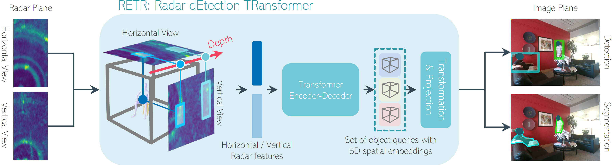

<!--
Copyright (C) 2024 Mitsubishi Electric Research Laboratories (MERL)

SPDX-License-Identifier: AGPL-3.0-or-later
-->
# [RETR: Multi-View Radar Detection Transformer for Indoor Perception [NeurIPS2024]](https://arxiv.org/abs/2411.10293)

PyTorch training and evaluation code for **RETR** (**R**adar d**E**tection **TR**ansformer).

RETR inherits the advantages of DETR, eliminating the need for hand-crafted components for object detection and segmentation in the image plane. RETR incorporates carefully designed modifications:
1) depth-prioritized feature similarity via a tunable positional encoding (TPE);
2) a tri-plane loss from both radar and camera coordinates;
3) using a calibrated or learnable radar-to-camera transformation via reparameterization, to account for the unique multi-view radar setting.
<table style="margin-left:auto;margin-right:auto;">
  <tr>
    <td style="text-align:center;">
      
    </td>
  </tr>
</table>

## Installation

Follow the steps below
```commandline
conda create -n retr python=3.10
conda activate retr
conda install pytorch==2.0.0 torchvision==0.15.0 torchaudio==2.0.0 pytorch-cuda=11.7 -c pytorch -c nvidia
pip install -r requirements.txt
```

## Download MMVR dataset

1. Download the MMVR dataset from [Zenodo](https://zenodo.org/records/12611978).
   - You should see the following four zip files:
     - `P1.zip`
     - `P2_00.zip`
     - `P2_01.zip`
     - `P2_02.zip`
2. Create a directory for the MMVR dataset:
   ```bash
   mkdir ./MMVR/
3. Unzip P1.zip as:
   ```bash
   unzip P1.zip "d1s1/*" "d1s2/*" "d2s2/*" "d3s1/*" "d3s2/*" "d4s1/*" -d ./MMVR/P1
4. Unzip P2_00.zip, P2_01.zip, P2_02.zip as
   ```bash
   unzip P2_00.zip -d ./MMVR/P2
   unzip P2_01.zip -d ./MMVR/P2
   unzip P2_02.zip -d ./MMVR/P2
5. The MMVR directory should have the following folder structure
    ```
    MMVR/
    ├── P1/
    │   ├── d1s1/
    │   │   ├── 000/
    │   │   |   ├──00000_meta.npz
    │   │   |   ├──00000_radar.npz
    │   │   |   ├──00000_bbox.npz
    │   │   |   ├──00000_pose.npz
    │   │   |   ├──00000_mask.npz
    │   │   |   .
    │   │   ├── 001/
    │   │   .
    │   .
    │   └── d4s1/
    └── P2/
        ├── d5s1/
        .
        └── d9s6/
    ```

## Data Preparation

RETR processes radar data by grouping a specific number of radar frames into segments. These segments are then used for model training and evaluation. This section provides instructions to create the segmented/grouped MMVR data from the above unziped MMVR folder.

1. Navigate to the `src/data` directory:
   ```bash
   cd ./src/data
2. Run the create_grouped_dataset.py script with the desired parameters:
    ```commandline
    python create_grouped_dataset.py --num_frames 4 --overlap 3 --dataset_dir ./MMVR --output ./MMVR
    ```
    ### Parameters
    - **`--num_frames`**
      Number of radar frames to combine into a single segment.
      *Example:* `--num_frames 4`

    - **`--overlap`**
      Number of overlapping frames between consecutive segments.
      *Example:* `--overlap 3`

    - **`--dataset_dir`**
      Path to the directory containing the unzipped MMVR dataset.
      *Example:* `--dataset_dir ./MMVR`

    - **`--output`**
      Path to the directory where the segmented/grouped dataset will be saved.
      *Example:* `--output ./MMVR/`

    The output directory will contain the segmented/grouped radar data in the format of `segment_{num_frames}_{overlap}`.

    In the above example, the unzipped MMVR directory will add a new folder `segment_4_3` under `./MMVR`.

## Quick Demo

Refer to `src/demo.ipynb`.

## Train
1. Navigate to the `src` directory:
   ```bash
   cd ./src
2. First, train the detection model using the grouped/segmented dataset:
    ```commandline
    python train.py --root ./MMVR/segment_4_3 --split P2S1 --task DET
    ```
    ### Parameters
    - **`--root`**
      The directory for grouped/segmented MMVR dataset. *Example:* `--root ./MMVR/segment_4_3`

    - **`--split`**
      Data protocol and data split in MMVR. [`P2S1` or `P2S2`].
      *Example:* `--split P2S1`

    - **`--task`**
      Detection task first.
      *Example:* `--task DET`

    You can specify training parameters such as batch size, learning rate, number of epochs, and number of workers using command-line arguments. Refer to `python train.py -h` for details.

    During training, log files and checkpoints are  automatically saved under the directory `../logs/refined/mmvr/[P2S1 or P2S2]/DET/YYYYmmdd_HHMMSS`, where `[P2S1 or P2S2]` corresponds to `--split` used for the training, and `YYYYmmdd_HHMMS` represents the timestamp of the training session.

3. Then, train the segmentation model using the trained detection model with frozen weights:
    ```commandline
    python train.py --root ./MMVR/segment_4_3 --split P2S1 --task SEG --det_path ../logs/refined/mmvr/[P2S1 or P2S2]/DET/YYYYmmdd_HHMMSS/best.pth
    ```
    ### Parameters
    - **`--root`**
      The directory for grouped/segmented MMVR dataset.
      *Example:* `--root ./MMVR/segment_4_3`

    - **`--split`**
      Data protocol and data split in MMVR. [`P2S1` or `P2S2`].
      *Example:* `--split P2S1`

    - **`--task`**
      now Segmentation task.
      *Example:* `--task SEG`

    - **`--det_path`**
      the best detection model checkpoint.
      *Example:* `--det_path ../logs/.../best.pth`

    During training, log files and segmentation checkpoints are automatically saved under the directory `../logs/refined/mmvr/[P2S1 or P2S2]/DETSEG/YYYYmmdd_HHMMSS`.


## Evaluation
1. Download pretrained RETR models from the links in the table below or directly from the GitHub repo `./logs/pretrained_model/[p2s1/p2s2]_retr_detseg.pth`.

   <table>
     <thead>
       <tr style="text-align: center;">
         <th>Dataset</th>
         <th>Split</th>
         <th>Backbone</th>
         <th>BBox AP</th>
         <th>BBox AR1</th>
         <th>Segm IoU</th>
         <th>Pretrained model link</th>
         <th>Size</th>
       </tr>
     </thead>
     <tbody>
       <tr style="text-align: center;">
         <td>MMVR</td>
         <td>P2S1</td>
         <td>ResNet18</td>
         <td>46.75</td>
         <td>42.19</td>
         <td>77.21</td>
         <td> <a href="https://github.com/merl-internal/retr_release/raw/refs/heads/main/logs/pretrained_model/p2s1_retr_detseg.pth">p2s1_retr_detseg.pth</a> </td>
         <td>156Mb</td>
       </tr>
       <tr style="text-align: center;">
         <td>MMVR</td>
         <td>P2S2</td>
         <td>ResNet18</td>
         <td>12.19</td>
         <td>19.70</td>
         <td>59.93</td>
         <td> <a href="https://github.com/merl-internal/retr_release/raw/refs/heads/main/logs/pretrained_model/p2s2_retr_detseg.pth">p2s2_retr_detseg.pth</a> </td>
         <td>156Mb</td>
       </tr>
     </tbody>
   </table>
2. Navigate to the `src` directory:
   ```bash
   cd ./src
3. Evaluate both Detection and Segmentation performance
    ```commandline
    python test.py --root ./MMVR/segment_4_3 --split [P2S1/P2S2] --task DETSEG --pretrained_path ../logs/pretrained_model/[p2s1/p2s2]_retr_detseg.pth
    ```
    ### Parameters
    - **`--root`**
      The directory for grouped/segmented MMVR dataset.
      *Example:* `--root ./MMVR/segment_4_3`

    - **`--split`**
      Data protocol and data split in MMVR. [`P2S1` or `P2S2`].
      *Example:* `--split P2S1`

    - **`--task`**
      Evaluate detetion and segmentation performance. [`DET` or `DETSEG`].
      *Example:* `--task DETSEG`

    - **`--pretrained_path`**
      The pretrained model checkpoints.
      *Example:* `--pretrained_path ../logs/pretrained_model/p2s1_retr_detseg.pth`

    You should obtain detection performance metrics such as `BBox AP`, `BBox AR1` and segmentation metrics like `Segm IoU` performance listed in the Table above. Additional metrics including `AP50`, `AP75`, and `AR10` are reported in our paper.

## Contributing

See [CONTRIBUTING.md](CONTRIBUTING.md) for our policy on contributions.

## Citation

If you use this repo, please cite our paper:
```
@misc{yataka2024_retrmultiviewradardetection,
   title       = {{RETR}: Multi-View Radar Detection Transformer for Indoor Perception},
   author      = {Ryoma Yataka and Adriano Cardace and Pu Perry Wang and Petros Boufounos and Ryuhei Takahashi},
   year        = {2024},
   eprint      = {2411.10293},
   archivePrefix={arXiv},
   primaryClass= {cs.CV},
   url         = {https://arxiv.org/abs/2411.10293},
}
```

---
## License
Released under `AGPL-3.0-or-later` license, as found in the [LICENSE.md](LICENSE.md) file.

All files, except as noted below:
```commandline
Copyright (C) 2024 Mitsubishi Electric Research Laboratories (MERL)

SPDX-License-Identifier: AGPL-3.0-or-later
```

The following files:
- `./src/models/module_retr/misc.py`
- `./src/models/module_retr/backbone.py`

were taken without modification from [here](https://github.com/facebookresearch/detr) (license included in [LICENSES/Apache-2.0.txt](LICENSES/Apache-2.0.txt)), with the following copyrights:
```commandline
Copyright (C) Facebook, Inc. and its affiliates.

SPDX-License-Identifier: Apache-2.0
```

The following file:
- `./src/models/module_retr/attention.py`

was taken without modification from [here](https://github.com/Atten4Vis/ConditionalDETR/tree/main) (license included in [LICENSES/Apache-2.0.txt](LICENSES/Apache-2.0.txt)), with the following copyrights:
```commandline
Copyright (C) 2021 Microsoft.

SPDX-License-Identifier: Apache-2.0
```

The following files:
- `./src/models/module_retr/__init__.py`
- `./src/models/module_retr/box_ops.py`
- `./src/models/module_retr/position_encoding.py`
- `./src/models/module_retr/segmentation.py`

were adapted from [here](https://github.com/facebookresearch/detr) (license included in [LICENSES/Apache-2.0.txt](LICENSES/Apache-2.0.txt)), with the following copyrights:
```commandline
Copyright (C) 2024 Mitsubishi Electric Research Laboratories (MERL)
Copyright (C) Facebook, Inc. and its affiliates.

SPDX-License-Identifier: AGPL-3.0-or-later
SPDX-License-Identifier: Apache-2.0
```

The following file:
- `./src/models/module_retr/hubconf.py`

was adapted from [here](https://github.com/Atten4Vis/ConditionalDETR/tree/main) (license included in [LICENSES/Apache-2.0.txt](LICENSES/Apache-2.0.txt)), with the following copyrights:
```commandline
Copyright (C) 2024 Mitsubishi Electric Research Laboratories (MERL)
Copyright (C) 2021 Microsoft.

SPDX-License-Identifier: AGPL-3.0-or-later
SPDX-License-Identifier: Apache-2.0
```

The following file:
- `./src/models/module_retr/utils.py`

was adapted from [here](https://github.com/wuzhiwyyx/RFMask-PUB/tree/main) (license included in [LICENSES/MIT.txt](LICENSES/MIT.txt)), with the following copyrights:
```commandline
Copyright (C) 2024 Mitsubishi Electric Research Laboratories (MERL)
Copyright (C) 2022 wuzhiwyyx.

SPDX-License-Identifier: AGPL-3.0-or-later
SPDX-License-Identifier: MIT
```

The following files:
- `./src/models/module_retr/detr.py`
- `./src/models/module_retr/matcher.py`
- `./src/models/module_retr/transformer.py`

were adapted from [here](https://github.com/facebookresearch/detr) and [here](https://github.com/Atten4Vis/ConditionalDETR/tree/main) (license included in [LICENSES/Apache-2.0.txt](LICENSES/Apache-2.0.txt)), with the following copyrights:
```commandline
Copyright (C) 2024 Mitsubishi Electric Research Laboratories (MERL)
Copyright (C) Facebook, Inc. and its affiliates.
Copyright (C) 2021 Microsoft.

SPDX-License-Identifier: AGPL-3.0-or-later
SPDX-License-Identifier: Apache-2.0
SPDX-License-Identifier: Apache-2.0
```
